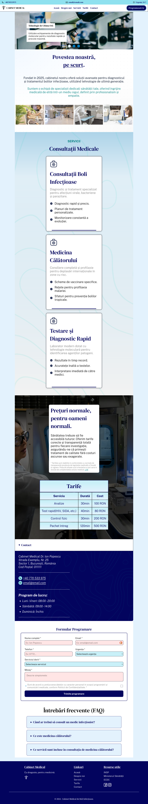

# Medical Clinic - Frontend Architecture Project

A web page project focused on mastering CSS architecture and systematic design concepts. This application is a presentation platform for a medical clinic, built with a strong emphasis on performance, scalability, and clean code.

## Live Demo
View the project live here: [https://cabinet-medical-proiect.vercel.app/](https://cabinet-medical-proiect.vercel.app)

## Screenshot

## Tech Stack & Methodologies

- **Semantic HTML5:** Structure optimized for accessibility and SEO.
- **SCSS (Sass):** Utilized for modularizing styles through partials, design tokens (variables), and controlled nesting.
- **BEM Methodology (Block Element Modifier):** Rigorously implemented to ensure predictable, isolated, and maintainable CSS.
- **Handmade Responsive Design:** Fluid layouts achieved using Flexbox, CSS Grid, and custom Media Queries.
- **Vanilla JavaScript:** Implementation of interactive elements (mobile navigation toggle, carousel logic, scroll effects) without external dependencies.
